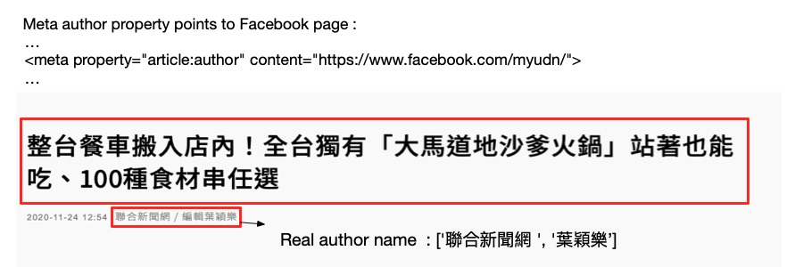

Over the past 2 years we have been using a mixture of existing open source content extraction such as newspaper3k, dragnet to ingest news. 
However each library only handles a particular case well, for example dragnet can handle content extraction in a wide varienty of forms due to its machine learning approach, while newspaper3k supports extraction of author, dates, keywords and other vital information which dragnet do not supports. Hence we decide to work on our own in house web extraction library which supports author, date, headline extraction using machine learning method similar to dragnet.

## Why machine learning approach?

As we expand our news coverage to over 60 languages and 70 countries, our extraction pipeline started facing issues that no single extraction library can handle all cases. We started writing lots of rule base post processing steps to ensure the final data is clean and valid. 

Moreover we found certain inconsistency between metadata provided and the actual value rendered in the news content. For example, this news site assign their own facebook page as the article author while the actual real author name is actually mentioned in the news article. 



Resolving these edge case creates an influx of housekeeping job which we could use to develop new features.

## Challenges for meta data extraction

Unlike content extraction, using the same design from dragnet to extract meta data such as author, date, headline is a sub optimal as these metadata is sparse and requires different post-processing pipelines.  

* author

After identify the author html blocks from the web page, you would need to extract author name tokens from the text. Since our data supports a wide varienty of languages, [tokenization](https://nlp.stanford.edu/IR-book/html/htmledition/tokenization-1.html) became a huge challenge. For instance, Chinese, Japanese, Korean, Thai text is written without any spaces between words. Moz has a very detail writings about [how to do author extraction](https://moz.com/devblog/web-page-author-extraction)


* headline

If specified, by the html tags headline usually consist of the top K sentence from article main body similar to extractive summarization.

* date

Although most website follows the html convention *<datetime>* or the JSON-LD which empowers easy parsing, there's still certain edge case where the news article didn't follow neither of the above, hence we can follow a similar methodology of author to extract the final date.

Unlike article content extraction, these meta-data are sparse which means among hundreds of data points there's only one correct answer. Hence using a strong machine learning models that can tackle this kind of data characteristic is important.


## Final design

We choose catboost because it handles heavily sparse datasets and handles features such as categorical and text features.

Author parser: in order to accommodate all kinds of languages, we use parse the name from authors in character level using a mixed of n-gram and character embeddings model. We were able to achieve 91% F1 scores based on our labeled datasets.

Callbacks: extractnet provides the flexibility to add custom callbacks function after meta data processing and during the end of extraction process. 

For example users can define a function which uses the extracted content to parse all the stock ticker and assigned them as *matched_ticker*, *matched_ticker* will return as one of the extracted attributes.

```python
def find_stock_ticker(raw_html, results):
    matched_ticker = []
    for ticket in re.findall(r'[$][A-Za-z][\S]*', str(results['content'])):
      matched_ticker.append(ticket)
    return {'matched_ticker': matched_ticker}

extract = Extractor(author_prob_threshold=0.1, 
      postprocess=[find_stock_ticker])

results = extract(raw_html_string) # 'matched_ticker': ['TSLA', ...]
```

Our library is now available at [Github](https://github.com/currentsapi/extractnet), supports Python3.

```python
pip install extractnet
```
